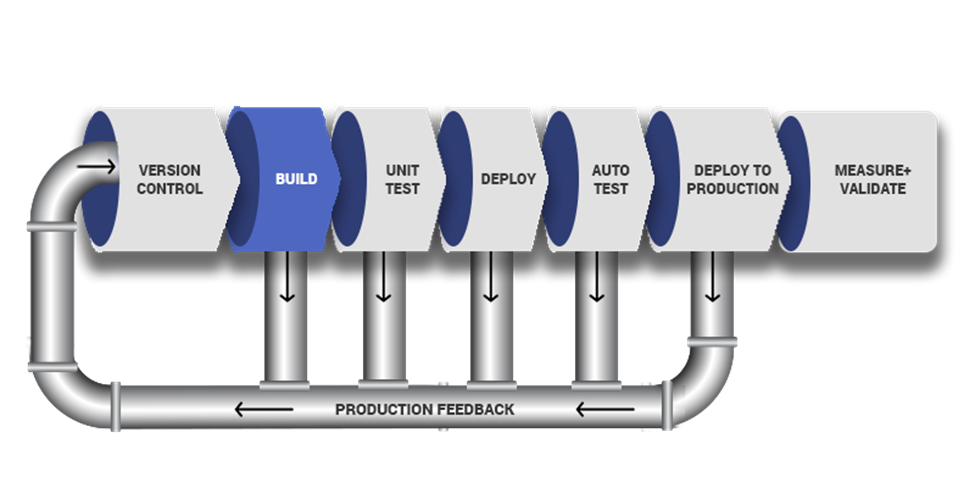
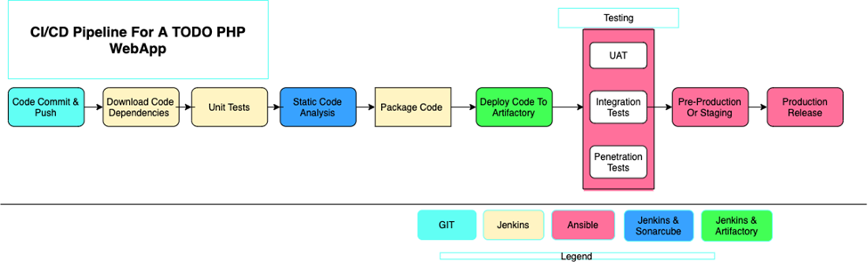
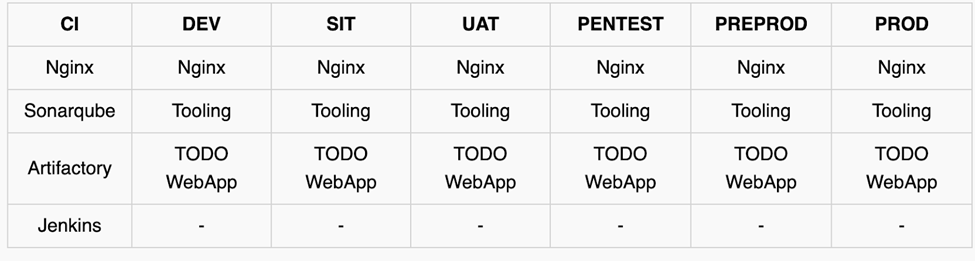
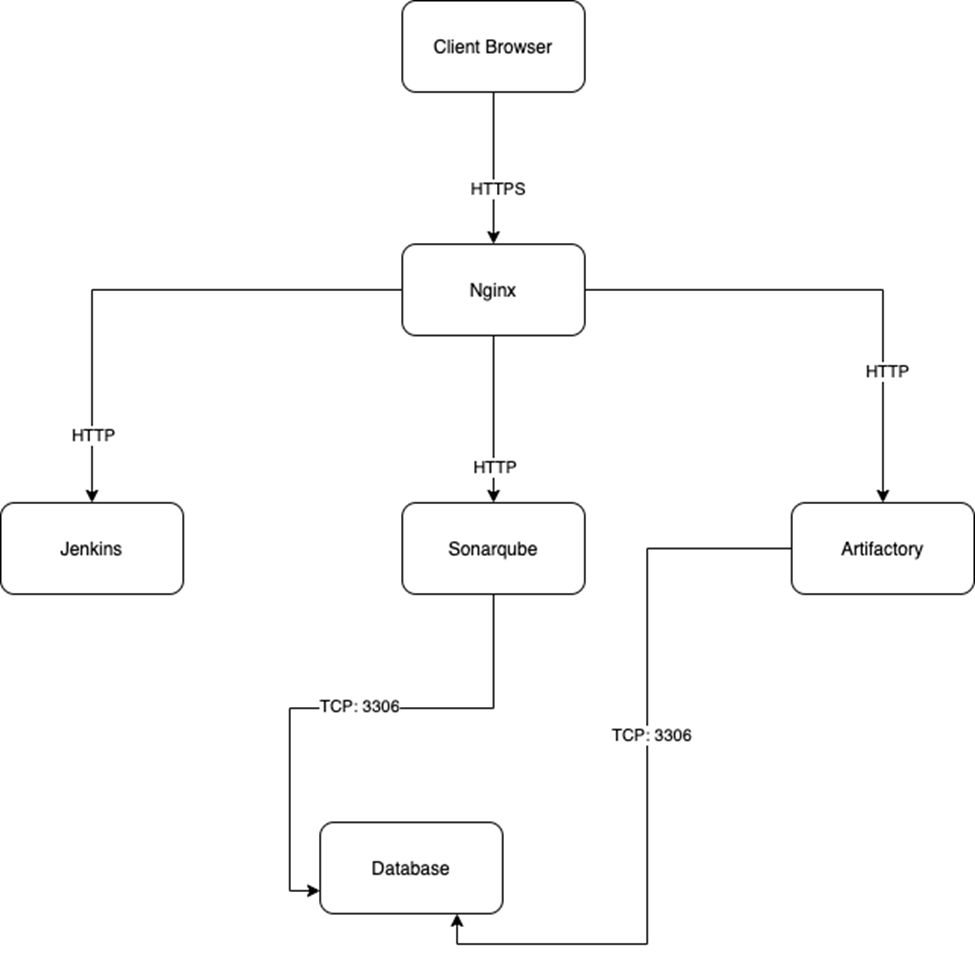
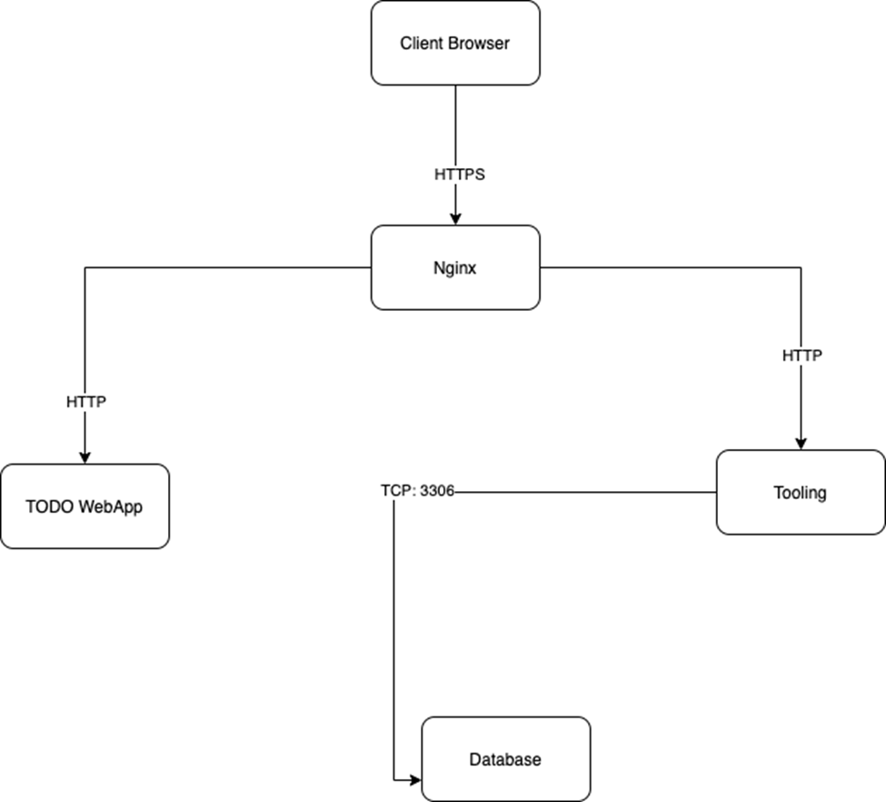

## EXPERIENCE CONTINUOUS INTEGRATION WITH JENKINS | ANSIBLE | ARTIFACTORY | SONARQUBE | PHP


**IMPORTANT NOTICE**– This project has some initial theoretical concepts that must be well understood before moving on to the practical part. Please read it carefully as many times as needed to completely digest the most important and fundamental DevOps concepts. To successfully implement this project, it is crucial to grasp the importance of the entire CI/CD process, roles of each tool and success metrics – so we encourage you to thoroughly study the following theory until you feel comfortable explaining all the concepts (e.g., to your new junior colleague or during a job interview).

In previous projects, you have been deploying a tooling website directly into the MARKDOWN_HASH40d1b2d83998fabacb726e5bc3d22129MARKDOWNHASH directory on dev servers. Well, even though that worked fine, and we were able to access the website, it is not the best way to do it. Real world web application code written on [Java](https://en.wikipedia.org/wiki/Java), [.NET](https://en.wikipedia.org/wiki/.NET_Framework) or other compiled programming languages require a build stage to create an executable file. The executable file (e.g., jar file in case of Java) contains all the codes embedded, and the necessary library dependencies, which the application needs to run and work successfully.

Some other programs written languages such as 
[PHP](https://en.wikipedia.org/wiki/.NET_Framework), [JavaScript](https://en.wikipedia.org/wiki/JavaScript) or [Python](https://en.wikipedia.org/wiki/Python_(programming_language)) work directly without being built into an executable file – these languages are called interpreted. That is why we could easily deploy the entire code from git into var/www/html and immediately the webserver was able to render the pages in a browser. However, it is not optimal to download code directly from Git onto our servers. There is a smarter way to package the entire application code, and track release versions. We can package the entire code and all its dependencies into an archive such as .tar.gz or .zip, so that it can be easily unpacked on a respective environment’s servers.

For a better understanding of the difference between compiled vs interpreted programming languages – [read this short article](https://www.freecodecamp.org/news/compiled-versus-interpreted-languages/).

In this project, you will understand and get hands on experience around the entire concept around CI/CD from applications perspective. To fully gain real expertise around this idea, it is best to see it in action across different programming languages and from the platform perspective too. From the application perspective, we will be focusing on [PHP](https://en.wikipedia.org/wiki/PHP) here; there are more projects ahead that are based on [Java](https://en.wikipedia.org/wiki/Java_(programming_language)), [Node.js](https://en.wikipedia.org/wiki/Node.js), [.Net](https://en.wikipedia.org/wiki/.NET_Framework) and [Python](https://en.wikipedia.org/wiki/Python_(programming_language)). By the time you start working on [Terraform](https://www.terraform.io/), [Docker](https://www.docker.com/) and [Kubernetes](https://kubernetes.io/) projects, you will get to see the platform perspective of CI/CD in action.

### What is Continuous Integration?
In software engineering, Continuous Integration (CI) is a practice of merging all developers’ working copies to a shared mainline (e.g., Git Repository or some other [version control system](https://en.wikipedia.org/wiki/Comparison_of_version-control_software)) several times per day. Frequent merges reduce chances of any conflicts in code and allow to run tests more often to avoid massive rework if something goes wrong. This principle can be formulated as Commit early, push often.
The general idea behind multiple commits is to avoid what is generally considered as Merge Hell or Integration hell. When a new developer joins a new project, he or she must create a copy of the main codebase by starting a new feature branch from the mainline to develop his own features (in some organization or team, this could be called a develop, main or master branch). If there are tens of developers working on the same project, they will all have their own branches created from mainline at different points in time. Once they make a copy of the repository it starts drifting away from the mainline with every new merge of other developers’ codes. If this lingers on for a very long time without reconciling the code, then this will cause a lot of code conflict or Merge Hell, as rightly said. Imagine such a hell from tens of developers or worse, hundreds. So, the best thing to do, is to continuously commit & push your code to the mainline. As many times as tens times per day. With this practice, you can avoid Merge Hell or Integration hell.

### CI concept is not only about committing your code. There is a general workflow, let us start it…

- Run tests locally: Before developers commit their code to a central repository, it is recommended to test the code locally. So, [Test-Driven Development (TDD)](https://en.wikipedia.org/wiki/Comparison_of_version-control_software) approach is commonly used in combination with CI. Developers write tests for their code called unit-tests, and before they commit their work, they run their tests locally. This practice helps a team to avoid having one developer’s work-in-progress code from breaking other developers’ copy of the codebase.
- Compile code in CI: After testing codes locally, developers commit and push their work to a central repository. Rather than building the code into an executable locally, a dedicated CI server picks up the code and runs the build there. In this project we will use, already familiar to you, Jenkins as our CI server. Build happens either periodically – by polling the repository at some configured schedule, or after every commit. Having a CI server where builds run is a good practice for a team, as everyone has visibility into each commit and its corresponding builds.
- Run further tests in CI: Even though tests have been run locally by developers, it is important to run the unit-tests on the CI server as well. But, rather than focusing solely on unit-tests, there are other kinds of tests and [code analysis](https://en.wikipedia.org/wiki/Program_analysis) that can be run using CI server. These are extremely critical to determining the overall quality of code being developed, how it interacts with other developers’ work, and how vulnerable it is to attacks. A CI server can use different tools for Static Code Analysis, Code Coverage Analysis, Code smells Analysis, and Compliance Analysis. In addition, it can run other types of tests such as Integration and Penetration tests. Other tasks performed by a CI server include production of code documentation from the source code and facilitate manual quality assurance (QA) testing processes.
- Deploy an artifact from CI: At this stage, the difference between CI and CD is spelt out. As you now know, CI is Continuous Integration, which is everything we have been discussing so far. CD on the other hand is Continuous Delivery which ensures that software checked into the mainline is always ready to be deployed to users. The deployment here is manually triggered after certain QA tasks are passed successfully. There is another CD known as Continuous Deployment which is also about deploying the software to the users, but rather than manual, it makes the entire process fully automated. Thus, Continuous Deployment is just one step ahead in automation than Continuous Delivery.
### Continuous Integration in The Real World
To emphasize a typical CI Pipeline further, let us explore the diagram below a little deeper.
 
 
- Version Control: This is the stage where developers’ code gets committed and pushed after they have tested their work locally.
- Build: Depending on the type of language or technology used, we may need to build the codes into [binary executable files](https://en.wikipedia.org/wiki/Executable) (in case of compiled languages) or just package the codes together with all necessary dependencies into a deployable package (in case of interpreted languages).
- Unit Test: Unit tests that have been developed by the developers are tested. Depending on how the CI job is configured, the entire pipeline may fail if part of the tests fails, and developers will have to fix this failure before starting the pipeline again. A Job by the way, is a phase in the pipeline. Unit Test is a phase, therefore it can be considered a job on its own.
- Deploy: Once the tests are passed, the next phase is to deploy the compiled or packaged code into an artifact repository. This is where all the various versions of code including the latest will be stored. The CI tool will have to pick up the code from this location to proceed with the remaining parts of the pipeline.
- Auto Test: Apart from Unit testing, there are many other kinds of tests that are required to analyse the quality of code and determine how vulnerable the software will be to external or internal attacks. These tests must be automated, and there can be multiple environments created to fulfil different test requirements. For example, a server dedicated for Integration Testing will have the code deployed there to conduct integration tests. Once that passes, there can be other sub-layers in the testing phase in which the code will be deployed to, so as to conduct further tests. Such are User Acceptance Testing (UAT), and another can be Penetration Testing. These servers will be named according to what they have been designed to do in those environments. A UAT server is generally be used for UAT, SIT server is for Systems Integration Testing, PEN Server is for Penetration Testing and they can be named whatever the naming style or convention in which the team is used. An environment does not necessarily have to reside on one single server. In most cases it might be a stack as you have defined in your Ansible Inventory. All the servers in the inventory/dev are considered as Dev Environment. The same goes for inventory/stage (Staging Environment) inventory/preprod (Pre-production environment), inventory/prod (Production environment), etc. So, it is all down to naming convention as agreed and used company or team wide.
•	Deploy to production: Once all the tests have been conducted and either the release manager or whoever has the authority to authorize the release to the production server is happy, he gives green light to hit the deploy button to ship the release to production environment. This is an Ideal Continuous Delivery Pipeline. If the entire pipeline was automated and no human is required to manually give the Go decision, then this would be considered as Continuous Deployment. Because the cycle will be repeated, and every time there is a code commit and push, it causes the pipeline to trigger, and the loop continues over and over again.
•	Measure and Validate: This is where live users are interacting with the application and feedback is being collected for further improvements and bug fixes. There are many metrics that must be determined and observed here. We will quickly go through 13 metrics that MUST be considered.

### Common Best Practices of CI/CD
Before we move on to observability metrics – let us list down the principles that define a reliable and robust CI/CD pipeline:
- Maintain a code repository
- Automate build process
- Make builds self-tested
- Everyone commits to the baseline every day
- Every commit to baseline should be built
- Every bug-fix commit should come with a test case
- Keep the build fast
- Test in a clone of production environment
- Make it easy to get the latest deliverables
- Everyone can see the results of the latest build
- Automate deployment (if you are confident enough in your CI/CD pipeline and willing to go for a fully automated Continuous Deployment)


### WHY ARE WE DOING EVERYTHING WE ARE DOING? – 13 DEVOPS SUCCESS METRICS
After all, DevOps is all about continuous delivery or deployment, and being able to ship out quality code as fast as possible. This is a very ambitious thing to desire; therefore, we must be careful not to break things as we are moving very fast. By tracking these metrics, we can determine our delivery speed and bottlenecks before breaking things. Ultimately, the goals of DevOps are enhanced Velocity, Quality, and Performance. But how do we track these parameters? Let us have a look at the 13 metrics to watch out for.
1. **Deployment frequency:** Tracking how often you do deployments is a good DevOps metric. Ultimately, the goal is to do more smaller deployments as often as possible. Reducing the size of deployments makes it easier to test and release. I would suggest counting both production and non-production deployments separately. How often you deploy to QA or pre-production environments is also important. You need to deploy early and often in QA to ensure enough time for testing.
2. **Lead time:** If the goal is to ship code quickly, this is a key DevOps metric. I would define lead time as the amount of time that occurs between starting on a work item until it is deployed. This helps you know that if you started on a new work item today, how long would it take on average until it gets to production.
3. **Customer tickets:** The best and worst indicator of application problems is customer support tickets and feedback. The last thing you want is your users reporting bugs or having problems with your software. Because of this, customer tickets also serve as a good indicator of application quality and performance problems.
4. **Percentage of passed automated tests:** To increase velocity, it is highly recommended that the development team makes extensive usage of unit and functional testing. Since DevOps relies heavily on automation, tracking how well automated tests work is a good DevOps metrics. It is good to know how often code changes break tests.
5. **Defect escape rate:** Do you know how many software defects are being found in production versus QA? If you want to ship code fast, you need to have confidence that you can find software defects before they get to production. Defect escape rate is a great DevOps metric to track how often those defects make it to production.
6. **Availability:** The last thing we ever want is for our application to be down. Depending on the type of application and how we deploy it, we may have a little downtime as part of scheduled maintenance. It is highly recommended to track this metric and all unplanned outages. Most software companies build status pages to track this. Such as this [Google Products Status Page](https://www.google.co.uk/appsstatus)
7. **Service level agreements:** Most companies have some service level agreement (SLA) that they promise to the customers. It is also important to track compliance with SLAs. Even if there are no formally stated SLAs, there probably are application non-functional requirements or expectations to be met.
8. **Failed deployments:** We all hope this never happens, but how often do our deployments cause an outage or major issues for the users? Reversing a failed deployment is something we never want to do, but it is something you should always plan for. If you have issues with failed deployments, be sure to track this metric over time. This could also be seen as tracking *Mean Time To Failure (MTTF).
9. **Error rates:** Tracking error rates within the application is super important. Not only they serve as an indicator of quality problems, but also ongoing performance and uptime related issues. In software development, errors are also known as exceptions, and proper exception handling is critical. If they are not handled nicely, we can figure it out while monitoring the rate of errors.

-  Bugs – Identify new exceptions being thrown in the code after a deployment
- Production issues – Capture issues with database connections, query timeouts, and other related issues
Presenting error rate metrics like this simply gives greater insights into where to focus attention.

10. **Application usage & traffic:** After a deployment, we want to see if the number of transactions or users accessing our system looks normal. If we suddenly have no traffic or a giant spike in traffic, something could be wrong. An attacker may be routing traffic elsewhere, or initiating a [DDOS attack](https://us.norton.com/internetsecurity-emerging-threats-what-is-a-ddos-attack-30sectech-by-norton.html)
11. **Application performance:** Before we even perform a deployment, we should configure monitoring tools like [Retrace](https://stackify.com/retrace/), [DataDog](https://www.datadoghq.com/), [New Relic](https://newrelic.com/), or [AppDynamics](https://en.wikipedia.org/wiki/AppDynamics) to look for performance problems, hidden errors, and other issues. During and after the deployment, we should also look for any changes in overall application performance and establish some benchmarks to know when things deviate from the norm.
It might be common after a deployment to see major changes in the usage of specific SQL queries, web service or HTTP calls, and other application dependencies. These monitoring tools can provide valuable visualizations like this one below that helps make it easy to spot problems.

12. **Mean time to detection (MTTD):** When problems happen, it is important that we identify them quickly. The last thing we want is to have a major partial or complete system outage and not know about it. Having robust application monitoring and good observability tools in place will help us detect issues quickly. Once they are detected, we also must fix them quickly!

13. **Mean time to recovery (MTTR):** This metric helps us track how long it takes to recover from failures. A key metric for the business is keeping failures to a minimum and being able to recover from them quickly. It is typically measured in hours and may refer to business hours, not calendar hours.
These are the major metrics that any DevOps team should track and monitor to understand how well CI/CD process is established and how it helps to deliver quality application to the users.


### SIMULATING A TYPICAL CI/CD PIPELINE FOR A PHP BASED APPLICATION
As part of the ongoing infrastructure development with Ansible started from Project 11, you will be tasked to create a pipeline that simulates continuous integration and delivery. Target end to end CI/CD pipeline is represented by the diagram below. It is important to know that both Tooling and TODO Web Applications are based on an interpreted ([scripting](https://en.wikipedia.org/wiki/Scripting_language)) language (PHP). It means, it can be deployed directly onto a server and will work without compiling the code to a machine language.
The problem with that approach is, it would be difficult to package and version the software for different releases. And so, in this project, we will be using a different approach for releases, rather than downloading directly from git, we will be using Ansible [uri module](https://docs.ansible.com/ansible/latest/collections/ansible/builtin/uri_module.html).
 


### Set Up
This project is partly a continuation of your Ansible work, so simply add and subtract based on the new setup in this project. It will require a lot of servers to simulate all the different environments from dev/ci all the way to production. This will be quite a lot of servers altogether (But you don’t have to create them all at once. Only create servers required for an environment you are working with at the moment. For example, when doing deployments for development, do not create servers for integration, pentest, or production yet).

Try to utilize your AWS free tier as much as you can, you can also register a new account if you have exhausted the current one. Alternatively, you can use [Google Cloud (GCP)](https://cloud.google.com/) to rent virtual machines from this cloud service provider – you can get $300 credit [here](https://clozon.com/try-google-cloud-services-and-get-300-credit-with-a-12-month-free-trial/) (NOTE: Please read instructions carefully to get your credits)
**NOTE:** This is still NOT a cloud-focus project yet. AWS cloud end to end project begins from project-15. Therefore, do not worry about advanced AWS or GCP configuration. All we need here is virtual machines that can be accessed over SSH.
To minimize the cost of cloud servers, you don not have to create all the servers at once, simply spin up a minimal server set up as you progress through the project implementation and have reached a need for more.
To get started, we will focus on these environments initially.
- Ci
- Dev
- Pentest

Both SIT – For System Integration Testing and UAT – User Acceptance Testing do not require a lot of extra installation or configuration. They are basically the webservers holding our applications. But Pentest – For Penetration testing is where we will conduct security related tests, so some other tools and specific configurations will be needed. In some cases, it will also be used for Performance and Load testing. Otherwise, that can also be a separate environment on its own. It all depends on decisions made by the company and the team running the show.

What we want to achieve, is having Nginx to serve as a [reverse proxy](https://en.wikipedia.org/wiki/Reverse_proxy) for our sites and tools. Each environment setup is represented in the below table and diagrams.



### CI-Environment


### Other Environments from Lower To Higher


Ansible Inventory should look like this

```yaml
├── ci
├── dev
├── pentest
├── pre-prod
├── prod
├── sit
└── uat
```


- ci inventory file

```yaml
[jenkins]
<Jenkins-Private-IP-Address>

[nginx]
<Nginx-Private-IP-Address>

[sonarqube]
<SonarQube-Private-IP-Address>

[artifact_repository]
<Artifact_repository-Private-IP-Address>
```

- dev inventory file

```yaml
[tooling]
<Tooling-Web-Server-Private-IP-Address>

[todo]
<Todo-Web-Server-Private-IP-Address>

[nginx]
<Nginx-Private-IP-Address>

[db:vars]
ansible_user=ec2-user

[db]
<DB-Server-Private-IP-Address>
```

- pentest inventory file

```yaml
[pentest:children]
pentest-todo
pentest-tooling

[pentest-todo]
<Pentest-for-Todo-Private-IP-Address>

[pentest-tooling]
<Pentest-for-Tooling-Private-IP-Address>
```

### Observations:
1.	You will notice that in the pentest inventory file, we have introduced a new concept pentest:children This is because, we want to have a group called pentest which covers Ansible execution against both pentest-todo and pentest-tooling simultaneously. But at the same time, we want the flexibility to run specific Ansible tasks against an individual group.
2.	The db group has a slightly different configuration. It uses a RedHat/Centos Linux distro. Others are based on Ubuntu (in this case user is ubuntu). Therefore, the user required for connectivity and path to python interpreter are different. If all your environment is based on Ubuntu, you may not need this kind of set up. Totally up to you how you want to do this. Whatever works for you is absolutely fine in this scenario.
This makes us to introduce another Ansible concept called group_vars. With group vars, we can declare and set variables for each group of servers created in the inventory file.
For example, If there are variables we need to be common between both pentest-todo and pentest-tooling, rather than setting these variables in many places, we can simply use the group_vars for pentest. Since in the inventory file it has been created as pentest:children Ansible recognizes this and simply applies that variable to both children.

## ANSIBLE ROLES FOR CI ENVIRONMENT

Now go ahead and Add two more roles to ansible:

1.	[SonarQube](https://www.sonarqube.org/) (Scroll down to the Sonarqube section to see instructions on how to set up and configure SonarQube manually)

### Why do we need SonarQube?
SonarQube is an open-source platform developed by SonarSource for continuous inspection of code quality, it is used to perform automatic reviews with static analysis of code to detect bugs, [code smells](https://en.wikipedia.org/wiki/Code_smell), and security vulnerabilities. [Watch a short description here](https://youtu.be/vE39Fg8pvZg). There is a lot more hands on work ahead with SonarQube and Jenkins. So, the purpose of SonarQube will be clearer to you very soon.

### Why do we need Artifactory?
[Watch a short description here](https://youtu.be/upJS4R6SbgM) Focus more on the first 10.08 mins

## Configuring the Jenkins Server

- Install jenkins with its dependencies using the official documentation from Jenkins [here](https://www.jenkins.io/doc/book/installing/linux/)

- Update the bash profile

```bash
sudo -i
```

```bash
nano .bash_profile
```

```bash
export JAVA_HOME=$(dirname $(dirname $(readlink $(readlink $(which java)))))
export PATH=$PATH:$JAVA_HOME/bin 
export CLASSPATH=.:$JAVA_HOME/jre/lib:$JAVA_HOME/lib:$JAVA_HOME/lib/tools.jar
```

- Reload the bash profile

```bash
source ~/.bash_profile
```

**NOTE:** This is done so that the path is exported anytime the machine is restarted

- Start the jenkins server

```bash	
sudo systemctl start jenkins
sudo systemctl enable jenkins
sudo systemctl status jenkins
```
- Install git and clone down your ansible-congig-mgt [repo](https://github.com/IwunzeGE/ansible-config-mgt.git)


### Configuring Ansible For Jenkins Deployment

In previous projects, you have been launching Ansible commands manually from a CLI. Now, with Jenkins, we will start running Ansible from Jenkins UI.
To do this,

1.	Navigate to Jenkins URL


2.	Install & Open Blue Ocean Jenkins Plugin


3.	Create a new pipeline
4.	Select GitHub


9.	Create a new pipelne


At this point you may not have a Jenkinsfile in the Ansible repository, so Blue Ocean will attempt to give you some guidance to create one. But we do not need that. We will rather create one ourselves. So, click on Administration to exit the Blue Ocean console.


- Create our Jenkinsfile

Inside the Ansible project, create a new directory deploy and start a new file Jenkinsfile inside the directory.

Add the code snippet below to start building the Jenkinsfile gradually. This pipeline currently has just one stage called Build and the only thing we are doing is using the shell script module to echo Building Stage

```yaml
pipeline {
    agent any

  stages {
    stage('Build') {
      steps {
        script {
          sh 'echo "Building Stage"'
        }
      }
    }
    }
}
```


- Now go back into the Ansible pipeline in Jenkins, and select configure

- Scroll down to Build Configuration section and specify the location of the Jenkinsfile at `deploy/Jenkinsfile`


This will trigger a build and you will be able to see the effect of our basic Jenkinsfile configuration by going through the console output of the build.


View this with Blue ocean


Let us see this in action.

1.	Create a new git branch and name it feature/jenkinspipeline-stages

2.	Currently we only have the Build stage. Let us add another stage called Test. Paste the code snippet below and push the new changes to GitHub.

```yaml
   pipeline {
    agent any

  stages {
    stage('Build') {
      steps {
        script {
          sh 'echo "Building Stage"'
        }
      }
    }

    stage('Test') {
      steps {
        script {
          sh 'echo "Testing Stage"'
        }
      }
    }
    }
}
```


3.	To make your new branch show up in Jenkins, we need to tell Jenkins to scan the repository.


4.	In Blue Ocean, you can now see how the Jenkinsfile has caused a new step in the pipeline launch build for the new branch.


5. Add more stages into the Jenkins file to simulate below phases. (Just add an echo command like we have in build and test stages)
   - Package 
   - Deploy 
   - Clean up
   


6. Verify in Blue Ocean that all the stages are working, then merge your feature branch to the main branch


7. Eventually, your main branch should have a successful pipeline like this in blue ocean.


## RUNNING ANSIBLE PLAYBOOK FROM JENKINS

Now that you have a broad overview of a typical Jenkins pipeline. Let us get the actual Ansible deployment to work by:
1.	Installing Ansible on Jenkins Server

```
sudo apt update && \
sudo apt install ansible -y && \
sudo apt install python3-pip -y && \
python3 -m pip install --upgrade pip setuptools && \
python3 -m pip install pyMySQL mysql-connector-python psycopg2-binary
```

Had this issue while installing, run this command if experiencing thesame;


2.	Installing Ansible plugin in Jenkins UI


3. Add credentials in Jenkins UI


You can [watch a 10 minutes video here](https://youtu.be/PRpEbFZi7nI) to guide you through the entire setup

**Note:** Ensure that Ansible runs against the Dev environment successfully.
Possible errors to watch out for:
1.	Ensure that the git module in Jenkinsfile is checking out SCM to main branch instead of master (GitHub has discontinued the use of Master due to Black Lives Matter. You can read more [here](https://www.cnet.com/news/microsofts-github-is-removing-coding-terms-like-master-and-slave))
2.	Jenkins needs to export the ANSIBLE_CONFIG environment variable. You can put the .ansible.cfg file alongside Jenkinsfile in the deploy directory. This way, anyone can easily identify that everything in there relates to deployment. Then, using the Pipeline Syntax tool in Ansible, generate the syntax to create environment variables to set.

https://wiki.jenkins.io/display/JENKINS/Building+a+software+project

**Possible issues to watch out for when you implement this**
1.	Remember that ansible.cfg must be exported to environment variable so that Ansible knows where to find Roles. But because you will possibly run Jenkins from different git branches, the location of Ansible roles will change. Therefore, you must handle this dynamically. You can use Linux [Stream Editor sed](https://www.gnu.org/software/sed/manual/sed.html) to update the section roles_path each time there is an execution. You may not have this issue if you run only from the main branch.
2.	If you push new changes to Git so that Jenkins failure can be fixed. You might observe that your change may sometimes have no effect. Even though your change is the actual fix required. This can be because Jenkins did not download the latest code from GitHub. Ensure that you start the Jenkinsfile with a clean up step to always delete the previous workspace before running a new one. Sometimes you might need to login to the Jenkins Linux server to verify the files in the workspace to confirm that what you are actually expecting is there. Otherwise, you can spend hours trying to figure out why Jenkins is still failing, when you have pushed up possible changes to fix the error.
3.	Another possible reason for Jenkins failure sometimes, is because you have indicated in the Jenkinsfile to check out the main git branch, and you are running a pipeline from another branch. So, always verify by logging onto the Jenkins box to check the workspace, and run git branch command to confirm that the branch you are expecting is there.
If everything goes well for you, it means, the Dev environment has an up-to-date configuration. But what if we need to deploy to other environments?
- Are we going to manually update the Jenkinsfile to point inventory to those environments? such as sit, uat, pentest, etc.
- Or do we need a dedicated git branch for each environment, and have the inventory part hard coded there.
Think about those for a minute and try to work out which one sounds more like a better solution.

Manually updating the Jenkinsfile is definitely not an option. And that should be obvious to you at this point. Because we try to automate things as much as possible.


Well, unfortunately, we will not be doing any of the highlighted options. What we will be doing is to parameterise the deployment. So that at the point of execution, the appropriate values are applied.


4. Configure ansible in UI


**NOTE:** I ran `Which ansible` to know the path to ansible executables directory, copy and paste below.


5. Generate your ansible playbook command by using pipeline syntax


6.	Creating Jenkinsfile from scratch. (Delete all you currently have in there and start all over to get Ansible to run successfully)

```yaml
pipeline {
  agent any

  environment {
      ANSIBLE_CONFIG="${WORKSPACE}/deploy/ansible.cfg"
    }

  parameters {
      string(name: 'inventory', defaultValue: 'dev',  description: 'This is the inventory file for the environment to deploy configuration')
    }

  stages{
      stage("Initial cleanup") {
          steps {
            dir("${WORKSPACE}") {
              deleteDir()
            }
          }
        }

      stage('Checkout SCM') {
         steps{
            git branch: 'main', url: 'https://github.com/IwunzeGE/ansible-config-mgt.git'
         }
       }

      stage('Prepare Ansible For Execution') {
        steps {
          sh 'echo ${WORKSPACE}' 
          sh 'sed -i "3 a roles_path=${WORKSPACE}/roles" ${WORKSPACE}/deploy/ansible.cfg'  
        }
     }

      stage('Run Ansible playbook') {
        steps {
           ansiblePlaybook become: true, colorized: true, credentialsId: 'private-key', disableHostKeyChecking: true, installation: 'ansible', inventory: 'inventory/dev', playbook: 'playbooks/site.yml'
         }
      }
      stage('Clean Workspace after build'){
        steps{
          cleanWs(cleanWhenAborted: true, cleanWhenFailure: true, cleanWhenNotBuilt: true, cleanWhenUnstable: true, deleteDirs: true)
        }
      }
    }
  }
```


- Create the ansible config file in the `deploy` dir `ansible.cfg` and paste the code below

```conf
[defaults]
timeout = 160
callback_whitelist = profile_tasks
log_path=~/ansible.log
host_key_checking = False
gathering = smart
ansible_python_interpreter=/usr/bin/python3
allow_world_readable_tmpfiles=true


[ssh_connection]
ssh_args = -o ControlMaster=auto -o ControlPersist=30m -o ControlPath=/tmp/ansible-ssh-%h-%p-%r -o ServerAliveInterval=60 -o ServerAliveCountMax=60 -o ForwardAgent=yes
```
- Run a build and ensure the playbook was well executed


## Parameterizing Jenkinsfile For Ansible Deployment

To deploy to other environments, we will need to use parameters.

1.	Update sit inventory with new servers

```yaml
[tooling]
<SIT-Tooling-Web-Server-Private-IP-Address>

[todo]
<SIT-Todo-Web-Server-Private-IP-Address>

[nginx]
<SIT-Nginx-Private-IP-Address>

[db:vars]
ansible_user=ec2-user

[db]
<SIT-DB-Server-Private-IP-Address>
```

2.	Update Jenkinsfile to introduce parameterization. Below is just one parameter. It has a default value in case if no value is specified at execution. It also has a description so that everyone is aware of its purpose.

```yaml
pipeline {
    agent any

    parameters {
      string(name: 'inventory', defaultValue: 'dev',  description: 'This is the inventory file for the environment to deploy configuration')
    }
}
```

3.	In the Ansible execution section, remove the hardcoded `inventory/dev` and replace with `${inventory}`. From now on, each time you hit on execute, it will expect an input.

4. Run a build with parameter to put it to test.


I experienced failure after building with parameter, but follow keenly how i fix it.
This troubleshooting was based on the console output, i.e role_path cant be found in ansible.cfg folder cant be found, just follow the images below;


Now we should have a successful build


## CI/CD PIPELINE FOR TODO APPLICATION

### Phase 1 – Prepare Jenkins

1.	Fork the repository below into your GitHub account
https://github.com/BosunEnoch7/php-todo.git

2.	On you Jenkins server, install PHP, its dependencies and Composer tool (Feel free to do this manually at first, then update your Ansible accordingly later)

```
sudo apt update
sudo apt install -y php-common php-mbstring php-opcache php-intl php-xml php-gd php-curl php-mysql php-fpm
sudo systemctl start php8.3-fpm
sudo systemctl enable php8.3-fpm
sudo systemctl enable php8.3-fpm
```


### Install composer

```
sud apt install -y curl php-cli php-mbstring unzip

curl -sS https://getcomposer.org/installer | php
sudo mv composer.phar /usr/local/bin/composer
```

### Install phpunit, phploc

```
sudo apt install -y wget php-cli php-mbstring php-xml php-zip unzip

# Install PHPUnit
wget -O phpunit https://phar.phpunit.de/phpunit-9.phar
chmod +x phpunit
sudo mv phpunit /usr/local/bin/phpunit

# Install phploc
wget -O phploc.phar https://phar.phpunit.de/phploc.phar
chmod +x phploc.phar
sudo mv phploc.phar /usr/local/bin/phploc

# Verify both
phpunit --version
phploc --version
```


3.	Install Jenkins plugins: Plot plugin and Artifactory plugin

- We will use plot plugin to display tests reports, and code coverage information.
- The Artifactory plugin will be used to easily upload code artifacts into an Artifactory server.

4. Run the build with the ci inventory so it updates the artifactory server
5. To confirm to go <public-ip:8081>. Login with the default credntials 'admin' and 'password' and then change the password, then proceed to creating a generic local repository. 
**NOTE:** It is required you open both port 8081 and 8082 in your inbound rules.


6. In Jenkins UI configure Artifactory


### Phase 2 – Integrate Artifactory repository with Jenkins
1.	Create a dummy Jenkinsfile in the [php-todo](https://github.com/IwunzeGE/php-todo.git) repository.
2.	Using Blue Ocean, create a multibranch Jenkins pipeline
3.	Edit your mysql roles to Create database  `homestead`, create user 'homestead'@'<Jenkins-instance-IP>' IDENTIFIED BY 'password'; GRANT ALL PRIVILEGES ON * . * TO 'homestead'@'%'; (THE IP ADDRESS OF THE USER WILL BE THAT OF THE JENKINS SERVER TO ALLOW REMOTE ACCESS). locate the file `roles/mysql/default/main.yml`


4.	Update the database connectivity requirements in the file `.env.sample` file

```bash
DB_CONNECTION=mysql
DB_PORT=3306
```


5.	Update Jenkinsfile with proper pipeline configuration

```yaml
pipeline {
    agent any

  stages {

     stage("Initial cleanup") {
          steps {
            dir("${WORKSPACE}") {
              deleteDir()
            }
          }
        }

    stage('Checkout SCM') {
      steps {
            git branch: 'main', url: 'https://github.com/IwunzeGE/php-todo.git'
      }
    }

    stage('Prepare Dependencies') {
      steps {
             sh 'mv .env.sample .env'
             sh 'composer install'
             sh 'php artisan migrate'
             sh 'php artisan db:seed'
             sh 'php artisan key:generate'
      }
    }
  }
}
```

6. Build and ensure  it works
If you get this error, then you need to inshtall mysql-client on the jenkins server and update the bind-address in the DB server


**Notice the Prepare Dependencies section**

- The required file by PHP is .env so we are renaming .env.sample to .env
- Composer is used by PHP to install all the dependent libraries used by the application
- Php artisan uses the .env file to setup the required database objects – (After successful run of this step, login to the database, run show tables and you will see the tables being created for you)

Update the Jenkinsfile to include Unit tests step

```yaml
    stage('Execute Unit Tests') {
      steps {
             sh './vendor/bin/phpunit'
      }
    }
```
    
### Phase 3 – Code Quality Analysis

1.	Add the code analysis step in Jenkinsfile. The output of the data will be saved in build/logs/phploc.csv file.

```yaml
    stage('Code Analysis') {
	  steps {
	        sh 'phploc app/ --log-csv build/logs/phploc.csv'	
	  }
   }
```

2.	Plot the data using plot Jenkins plugin.
This plugin provides generic plotting (or graphing) capabilities in Jenkins. It will plot one or more single values variations across builds in one or more plots. Plots for a particular job (or project) are configured in the job configuration screen, where each field has additional help information. Each plot can have one or more lines (called data series). After each build completes the plots’ data series latest values are pulled from the CSV file generated by phploc.

```yaml
    stage('Plot Code Coverage Report') {
      steps {

            plot csvFileName: 'plot-396c4a6b-b573-41e5-85d8-73613b2ffffb.csv', csvSeries: [[displayTableFlag: false, exclusionValues: 'Lines of Code (LOC),Comment Lines of Code (CLOC),Non-Comment Lines of Code (NCLOC),Logical Lines of Code (LLOC)                          ', file: 'build/logs/phploc.csv', inclusionFlag: 'INCLUDE_BY_STRING', url: '']], group: 'phploc', numBuilds: '100', style: 'line', title: 'A - Lines of code', yaxis: 'Lines of Code'
            plot csvFileName: 'plot-396c4a6b-b573-41e5-85d8-73613b2ffffb.csv', csvSeries: [[displayTableFlag: false, exclusionValues: 'Directories,Files,Namespaces', file: 'build/logs/phploc.csv', inclusionFlag: 'INCLUDE_BY_STRING', url: '']], group: 'phploc', numBuilds: '100', style: 'line', title: 'B - Structures Containers', yaxis: 'Count'
            plot csvFileName: 'plot-396c4a6b-b573-41e5-85d8-73613b2ffffb.csv', csvSeries: [[displayTableFlag: false, exclusionValues: 'Average Class Length (LLOC),Average Method Length (LLOC),Average Function Length (LLOC)', file: 'build/logs/phploc.csv', inclusionFlag: 'INCLUDE_BY_STRING', url: '']], group: 'phploc', numBuilds: '100', style: 'line', title: 'C - Average Length', yaxis: 'Average Lines of Code'
            plot csvFileName: 'plot-396c4a6b-b573-41e5-85d8-73613b2ffffb.csv', csvSeries: [[displayTableFlag: false, exclusionValues: 'Cyclomatic Complexity / Lines of Code,Cyclomatic Complexity / Number of Methods ', file: 'build/logs/phploc.csv', inclusionFlag: 'INCLUDE_BY_STRING', url: '']], group: 'phploc', numBuilds: '100', style: 'line', title: 'D - Relative Cyclomatic Complexity', yaxis: 'Cyclomatic Complexity by Structure'      
            plot csvFileName: 'plot-396c4a6b-b573-41e5-85d8-73613b2ffffb.csv', csvSeries: [[displayTableFlag: false, exclusionValues: 'Classes,Abstract Classes,Concrete Classes', file: 'build/logs/phploc.csv', inclusionFlag: 'INCLUDE_BY_STRING', url: '']], group: 'phploc', numBuilds: '100', style: 'line', title: 'E - Types of Classes', yaxis: 'Count'
            plot csvFileName: 'plot-396c4a6b-b573-41e5-85d8-73613b2ffffb.csv', csvSeries: [[displayTableFlag: false, exclusionValues: 'Methods,Non-Static Methods,Static Methods,Public Methods,Non-Public Methods', file: 'build/logs/phploc.csv', inclusionFlag: 'INCLUDE_BY_STRING', url: '']], group: 'phploc', numBuilds: '100', style: 'line', title: 'F - Types of Methods', yaxis: 'Count'
            plot csvFileName: 'plot-396c4a6b-b573-41e5-85d8-73613b2ffffb.csv', csvSeries: [[displayTableFlag: false, exclusionValues: 'Constants,Global Constants,Class Constants', file: 'build/logs/phploc.csv', inclusionFlag: 'INCLUDE_BY_STRING', url: '']], group: 'phploc', numBuilds: '100', style: 'line', title: 'G - Types of Constants', yaxis: 'Count'
            plot csvFileName: 'plot-396c4a6b-b573-41e5-85d8-73613b2ffffb.csv', csvSeries: [[displayTableFlag: false, exclusionValues: 'Test Classes,Test Methods', file: 'build/logs/phploc.csv', inclusionFlag: 'INCLUDE_BY_STRING', url: '']], group: 'phploc', numBuilds: '100', style: 'line', title: 'I - Testing', yaxis: 'Count'
            plot csvFileName: 'plot-396c4a6b-b573-41e5-85d8-73613b2ffffb.csv', csvSeries: [[displayTableFlag: false, exclusionValues: 'Logical Lines of Code (LLOC),Classes Length (LLOC),Functions Length (LLOC),LLOC outside functions or classes ', file: 'build/logs/phploc.csv', inclusionFlag: 'INCLUDE_BY_STRING', url: '']], group: 'phploc', numBuilds: '100', style: 'line', title: 'AB - Code Structure by Logical Lines of Code', yaxis: 'Logical Lines of Code'
            plot csvFileName: 'plot-396c4a6b-b573-41e5-85d8-73613b2ffffb.csv', csvSeries: [[displayTableFlag: false, exclusionValues: 'Functions,Named Functions,Anonymous Functions', file: 'build/logs/phploc.csv', inclusionFlag: 'INCLUDE_BY_STRING', url: '']], group: 'phploc', numBuilds: '100', style: 'line', title: 'H - Types of Functions', yaxis: 'Count'
            plot csvFileName: 'plot-396c4a6b-b573-41e5-85d8-73613b2ffffb.csv', csvSeries: [[displayTableFlag: false, exclusionValues: 'Interfaces,Traits,Classes,Methods,Functions,Constants', file: 'build/logs/phploc.csv', inclusionFlag: 'INCLUDE_BY_STRING', url: '']], group: 'phploc', numBuilds: '100', style: 'line', title: 'BB - Structure Objects', yaxis: 'Count'

      }
    }
```

You should now see a Plot menu item on the left menu. Click on it to see the charts. (The analytics may not mean much to you as it is meant to be read by developers. So, you need not worry much about it – this is just to give you an idea of the real-world implementation).


3.	Bundle the application code for into an artifact (archived package) upload to Artifactory

```yaml
stage ('Package Artifact') {
    steps {
            sh 'zip -qr php-todo.zip ${WORKSPACE}/*'
     }
    }
```

4.	Publish the resulted artifact into Artifactory

```yaml
stage ('Upload Artifact to Artifactory') {
          steps {
            script { 
                 def server = Artifactory.server 'artifactory-server'                 
                 def uploadSpec = """{
                    "files": [
                      {
                       "pattern": "php-todo.zip",
                       "target": "<name-of-artifact-repository>/php-todo",
                       "props": "type=zip;status=ready"

                       }
                    ]
                 }""" 

                 server.upload spec: uploadSpec
               }
            }

        }
```

5.	Deploy the application to the dev environment by launching Ansible pipeline
- Launch a server for the todo app
- Add the private Ip to the inventory list in `dev`

```yaml
[todo]
<todo-private-IP>
```
- Create a `/static-assignements/deployment.yml` file and update it with the below snippet

```yaml
---
- name: Deploying the PHP Applicaion to Dev Enviroment
  become: true
  hosts: todo
  tasks:
    - name: install remi and rhel repo
      ansible.builtin.yum:
        name: 
          - https://dl.fedoraproject.org/pub/epel/epel-release-latest-8.noarch.rpm
          - dnf-utils
          - https://rpms.remirepo.net/enterprise/remi-release-8.rpm
        disable_gpg_check: yes

    
    - name: install httpd on the webserver
      ansible.builtin.yum:
        name: httpd
        state: present

    - name: ensure httpd is started and enabled
      ansible.builtin.service:
        name: httpd
        state: started 
        enabled: yes
      
    - name: install PHP
      ansible.builtin.yum:
        name:
          - php 
          - php-mysqlnd
          - php-gd 
          - php-curl
          - unzip
          - php-common
          - php-mbstring
          - php-opcache
          - php-intl
          - php-xml
          - php-fpm
          - php-json
        enablerepo: php:remi-7.4
        state: present
    
    - name: ensure php-fpm is started and enabled
      ansible.builtin.service:
        name: php-fpm
        state: started 
        enabled: yes

    - name: Download the artifact
      get_url:
        url: http://13.52.250.218:8082/artifactory/rockchip/php-todo
        dest: /home/ec2-user/
        url_username: admin

    - name: unzip the artifacts
      ansible.builtin.unarchive:
       src: /home/ec2-user/php-todo
       dest: /home/ec2-user/
       remote_src: yes

    - name: deploy the code
      ansible.builtin.copy:
        src: /home/ec2-user/var/lib/jenkins/workspace/php-todo_main/
        dest: /var/www/html/
        force: yes
        remote_src: yes

    - name: remove nginx default page
      ansible.builtin.file:
        path: /etc/httpd/conf.d/welcome.conf
        state: absent

    - name: restart httpd
      ansible.builtin.service:
        name: httpd
        state: restarted
```

- Edit the artifact url, username and password to match yours
- To get the artifacts password


Add to Jenkin Credentials


- Add this snippet to the Jenkinsfile

```yaml
stage ('Deploy to Dev Environment') {
    steps {
    build job: 'ansible-config-mgt/main', parameters: [[$class: 'StringParameterValue', name: 'env', value: 'dev']], propagate: false, wait: true
    }
  }
```
- Scan the repo, the php-todo should build first and subsequently trigger the build of the ansible-config-mgt when it gets to the Deploy stage.


## SONARQUBE INSTALLATION

Before we start getting hands on with SonarQube configuration, it is incredibly important to understand a few concepts:
- [Software Quality](https://en.wikipedia.org/wiki/Software_quality) – The degree to which a software component, system or process meets specified requirements based on user needs and expectations.
- [Software Quality Gates](https://docs.sonarqube.org/latest/user-guide/quality-gates/) – Quality gates are basically acceptance criteria which are usually presented as a set of predefined quality criteria that a software development project must meet in order to proceed from one stage of its lifecycle to the next one.

SonarQube is a tool that can be used to create quality gates for software projects, and the ultimate goal is to be able to ship only quality software code.
Despite that DevOps CI/CD pipeline helps with fast software delivery, it is of the same importance to ensure the quality of such delivery. Hence, we will need SonarQube to set up Quality gates. In this project we will use predefined Quality Gates (also known as The [Sonar Way](https://docs.sonarqube.org/latest/instance-administration/quality-profiles/)). Software testers and developers would normally work with project leads and architects to create custom quality gates.

### Install SonarQube on Ubuntu 20.04 With PostgreSQL as Backend Database
Here is a manual approach to installation. Ensure that you can to automate the same with Ansible.
Below is a step by step guide how to install SonarQube 7.9.3 version. It has a strong prerequisite to have Java installed since the tool is Java-based. MySQL support for SonarQube is deprecated, therefore we will be using PostgreSQL.
We will make some Linux Kernel configuration changes to ensure optimal performance of the tool – we will increase vm.max_map_count, file discriptor and ulimit.


### Tune Linux Kernel

This can be achieved by making session changes which does not persist beyond the current session terminal. 

```bash
sudo sysctl -w vm.max_map_count=262144
sudo sysctl -w fs.file-max=65536
ulimit -n 65536
ulimit -u 4096
```

To make a permanent change, edit the file `/etc/security/limits.conf` and append the below

```bash
sonarqube   -   nofile   65536
sonarqube   -   nproc    4096
```

Before installing, let us update and upgrade system packages:

```bash
sudo apt-get update
sudo apt-get upgrade
```

Install [wget](https://www.gnu.org/software/wget/) and [unzip](https://linux.die.net/man/1/unzip) packages

```bash
sudo apt-get install wget unzip -y
```

Install [OpenJDK](https://openjdk.java.net/) and [Java Runtime Environment (JRE) 11](https://docs.oracle.com/goldengate/1212/gg-winux/GDRAD/java.htm)

```bash
sudo apt-get install openjdk-11-jdk -y
sudo apt-get install openjdk-11-jre -y
```

Set default JDK – To set default JDK or switch to OpenJDK enter below command:
```bash
sudo update-alternatives --config java
```


If you have multiple versions of Java installed, you should see a list like below:

```bash
Selection    Path                                            Priority   Status

------------------------------------------------------------

  0            /usr/lib/jvm/java-11-openjdk-amd64/bin/java      1111      auto mode

  1            /usr/lib/jvm/java-11-openjdk-amd64/bin/java      1111      manual mode

  2            /usr/lib/jvm/java-8-openjdk-amd64/jre/bin/java   1081      manual mode

* 3            /usr/lib/jvm/java-8-oracle/jre/bin/java          1081      manual mode
Type "1" to switch OpenJDK 11
```

Install and Setup PostgreSQL 10 Database for SonarQube

- The command below will add PostgreSQL repo to the repo list:
`sudo sh -c 'echo "deb http://apt.postgresql.org/pub/repos/apt/ `lsb_release -cs`-pgdg main" >> /etc/apt/sources.list.d/pgdg.list'`

- Download PostgreSQL software

`wget -q https://www.postgresql.org/media/keys/ACCC4CF8.asc -O - | sudo apt-key add -`

- Install PostgreSQL Database Server

`sudo apt-get -y install postgresql postgresql-contrib`

- Start PostgreSQL Database Server

`sudo systemctl start postgresql`

- Enable it to start automatically at boot time

`sudo systemctl enable postgresql`

- Change the password for default postgres user (Pass in the password you intend to use, and remember to save it somewhere)

`sudo passwd postgres`

- Switch to the postgres user

`su - postgres`

- Create a new user by typing

`createuser sonar`

- Switch to the PostgreSQL shell

`psql`

- Set a password for the newly created user for SonarQube database

`ALTER USER sonar WITH ENCRYPTED password 'sonar';`

- Create a new database for PostgreSQL database by running:

`CREATE DATABASE sonarqube OWNER sonar;`

- Grant all privileges to sonar user on sonarqube Database.

`grant all privileges on DATABASE sonarqube to sonar;`

- Exit from the psql shell:

`\q`

- Switch back to the sudo user by running the exit command.
`exit`

Install SonarQube on Ubuntu 20.04 LTS

- Navigate to the tmp directory to temporarily download the installation files

`cd /tmp && sudo wget https://binaries.sonarsource.com/Distribution/sonarqube/sonarqube-7.9.3.zip`

- Unzip the archive setup to /opt directory

`sudo unzip sonarqube-7.9.3.zip -d /opt`

- Move extracted setup to /opt/sonarqube directory

`sudo mv /opt/sonarqube-7.9.3 /opt/sonarqube`


CONFIGURE SONARQUBE

We cannot run SonarQube as a root user, if you run using root user it will stop automatically. The ideal approach will be to create a separate group and a user to run SonarQube

- Create a group sonar

`sudo groupadd sonar`

- Now add a user with control over the /opt/sonarqube directory
```
sudo useradd -c "user to run SonarQube" -d /opt/sonarqube -g sonar sonar 
sudo chown sonar:sonar /opt/sonarqube -R
```

- Open SonarQube configuration file using your favourite text editor (e.g., nano or vim)
`sudo nano /opt/sonarqube/conf/sonar.properties`

- Find the following lines,  Uncomment them and provide the values of PostgreSQL Database username and password
```
#sonar.jdbc.username=
#sonar.jdbc.password=
```

- Edit the sonar script file and set RUN_AS_USER

`sudo nano /opt/sonarqube/bin/linux-x86-64/sonar.sh`

```
RUN_AS_USER=sonar
```

Now, to start SonarQube we need to do following:

- Switch to sonar user

`sudo su sonar`

- Move to the script directory

`cd /opt/sonarqube/bin/linux-x86-64/`

- Run the script to start SonarQube

`./sonar.sh start`

- Check SonarQube running status:

`./sonar.sh status`

- To check SonarQube logs, navigate to `/opt/sonarqube/logs/sonar.log` directory.

Configure SonarQube to run as a systemd service

- Stop the currently running SonarQube service

`cd /opt/sonarqube/bin/linux-x86-64/`

- Run the script to start SonarQube

`./sonar.sh stop`

- Create a systemd service file for SonarQube to run as System Startup.

`sudo nano /etc/systemd/system/sonar.service`

- Add the configuration below for systemd to determine how to start, stop, check status, or restart the SonarQube service.

```bash
[Unit]
Description=SonarQube service
After=syslog.target network.target

[Service]
Type=forking

ExecStart=/opt/sonarqube/bin/linux-x86-64/sonar.sh start
ExecStop=/opt/sonarqube/bin/linux-x86-64/sonar.sh stop

User=sonar
Group=sonar
Restart=always

LimitNOFILE=65536
LimitNPROC=4096

[Install]
WantedBy=multi-user.target
```

- Save the file and control the service with systemctl

```bash
sudo systemctl start sonar
sudo systemctl enable sonar
sudo systemctl status sonar
```


### Access SonarQube

- To access SonarQube using browser, type server’s IP address followed by port 9000
`http://server_IP:9000 OR http://localhost:9000`

- Login to SonarQube with default administrator username and password – admin


### CONFIGURE SONARQUBE AND JENKINS FOR QUALITY GATE

- In Jenkins, install SonarQube Scanner plugin
- Navigate to configure system in Jenkins. Add SonarQube server as shown below:


- Configure Quality Gate Jenkins Webhook in SonarQube – The URL should point to your Jenkins server `http://{JENKINS_HOST}/sonarqube-webhook/`


- Setup SonarQube scanner from Jenkins – Global Tool Configuration


- Update Jenkins Pipeline to include SonarQube scanning and Quality Gate. Below is the snippet for a Quality Gate stage in Jenkinsfile. The Quality gate should come in before you package the artifacts.

```yaml
    stage('SonarQube Quality Gate') {
        environment {
            scannerHome = tool 'SonarQubeScanner'
        }
        steps {
            withSonarQubeEnv('sonarqube') {
                sh "${scannerHome}/bin/sonar-scanner"
            }

        }
    }
```

**NOTE:** The above step will fail because we have not updated `sonar-scanner.properties`


- Configure sonar-scanner.properties – From the step above, Jenkins will install the scanner tool on the Linux server. You will need to go into the tools directory on the server to configure the properties file in which SonarQube will require to function during pipeline execution.

`cd /var/lib/jenkins/tools/hudson.plugins.sonar.SonarRunnerInstallation/SonarQubeScanner/conf/`

- Open sonar-scanner.properties file

`sudo vi sonar-scanner.properties`

- Add configuration related to php-todo project

```
sonar.host.url=http://<SonarQube-Server-IP-address>:9000
sonar.projectKey=php-todo
#----- Default source code encoding
sonar.sourceEncoding=UTF-8
sonar.php.exclusions=**/vendor/**
sonar.php.coverage.reportPaths=build/logs/clover.xml
sonar.php.tests.reportPath=build/logs/junit.xml
```


**NOTE:** I had to add the `sonar.sources=/var/lib/jenkins/workspace/php-todo_main` because thhe error from the previous screenshot showed that the source to the projectKey wasn't specified.


The quality gate we just included has no effect. Why? Well, because if you go to the SonarQube UI, you will realise that we just pushed a poor-quality code onto the development environment.
- Navigate to php-todo project in SonarQube


There are eight bugs, and there is 0.0% code coverage. (code coverage is a percentage of unit tests added by developers to test functions and objects in the code)
- If you click on php-todo project for further analysis, you will see that there is 6 hours’ worth of technical debt, code smells and security issues in the code.

- Below are the eight bugs and how the developer can fix it


In the development environment, this is acceptable as developers will need to keep iterating over their code towards perfection. But as a DevOps engineer working on the pipeline, we must ensure that the quality gate step causes the pipeline to fail if the conditions for quality are not met. To achieve this we'll have  to edit our Jenkinsfile.

```
stage('SonarQube Quality Gate') {
      when { branch pattern: "^develop*|^hotfix*|^release*|^main*", comparator: "REGEXP"}
        environment {
            scannerHome = tool 'SonarQubeScanner'
        }
        steps {
            withSonarQubeEnv('sonarqube') {
                sh "${scannerHome}/bin/sonar-scanner -Dproject.settings=sonar-project.properties"
            }
            timeout(time: 1, unit: 'MINUTES') {
                waitForQualityGate abortPipeline: true
            }
        }
    }
```

### Conditionally deploy to higher environments
In the real world, developers will work on feature branch in a repository (e.g., GitHub or GitLab). There are other branches that will be used differently to control how software releases are done. You will see such branches as:
- Develop
- Master or Main
(The * is a place holder for a version number, Jira Ticket name or some description. It can be something like Release-1.0.0)
- Feature/*
- Release/*
- Hotfix/*
etc.
There is a very wide discussion around release strategy, and git branching strategies which in recent years are considered under what is known as [GitFlow](https://www.atlassian.com/git/tutorials/comparing-workflows/gitflow-workflow) (Have a read and keep as a bookmark – it is a possible candidate for an interview discussion, so take it seriously!)
Assuming a basic gitflow implementation restricts only the develop branch to deploy code to Integration environment like sit.
Let us update our Jenkinsfile to implement this:

To test, create different branches and push to GitHub. You will realise that only branches other than develop, hotfix, release, main, or master will be able to deploy the code.
If everything goes well, you should be able to see something like this:


### Complete the following tasks to finish Project 14
1.	Introduce Jenkins agents/slaves – Add 2 more servers to be used as Jenkins slave. Configure Jenkins to run its pipeline jobs randomly on any available slave nodes.
2.	Configure webhook between Jenkins and GitHub to automatically run the pipeline when there is a code push.
3.	Deploy the application to all the environments
4.	**Optional** – Experience pentesting in pentest environment by configuring [Wireshark](https://www.wireshark.org/) there and just explore for information sake only. [Watch Wireshark Tutorial here](https://youtu.be/Yo8zGbCbqd0)
- Ansible Role for Wireshark:
- https://github.com/ymajik/ansible-role-wireshark (Ubuntu)
- https://github.com/wtanaka/ansible-role-wireshark (RedHat)

## Configure Jenkins Slave

- Install Java

`sudo yum install java-11-openjdk-devel -y`

- Update the bash profile

`sudo -i`

`nano .bash_profile`

```
export JAVA_HOME=$(dirname $(dirname $(readlink $(readlink $(which java)))))
export PATH=$PATH:$JAVA_HOME/bin 
export CLASSPATH=.:$JAVA_HOME/jre/lib:$JAVA_HOME/lib:$JAVA_HOME/lib/tools.jar
```

- Reload the bash profile

`source ~/.bash_profile`


### Congratulations! 
You have just experienced one of the most interesting and complex projects in you Project Based Learning journey so far.
