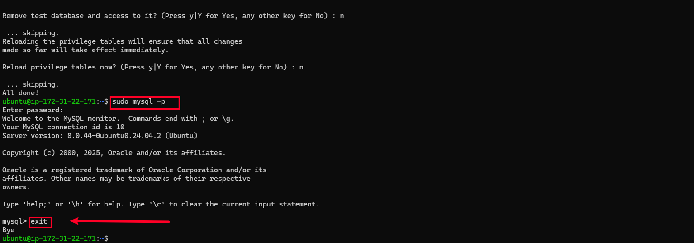

# LAMP STACK STACK IMPLEMENTATION IN AWS (Linux, Apache, MySQL, PHP) 

**This document details the provisioning of a LAMP stack (Linux, Apache, MySQL and PHP) on an AWS EC2 instance. The setup process was executed as part of environment configuration, and the screenshots below serve as deployment artifacts, presented in the order they were captured during the stack initialization.**

# Step 0 – Preparing prerequisites
 In order to complete this project, you will need an AWS account and a virtual server with Ubuntu 
Server OS. 

- Register an AWS accout if you have none

- Launch a new EC2 instance of t2.micro family with Ubuntu Server 20.04 LTS (HVM) on AWS.

- Connect to the instance on your local machine.

- You will have an outcome as this after a successful connection to your local machine

# STEP 1 — INSTALLING APACHE AND UPDATING THE FIREWALL 

Install Apache using Ubuntu’s package manager ‘apt’

- Update a list of packages in package manager by running `sudo apt update`

- Run apache2 package installation `sudo apt install apache2`

- To verify that apache2 is running as a Service in our OS, use following command `sudo systemctl status apache2`

If it is green and running, then you did everything correctly – you have just launched your first 
Web Server in the Clouds! 

- Before we can receive any traffic by our Web Server, we need to open TCP port 80 which is the 
default port that web browsers use to access web pages on the Internet 
As we know, we have TCP port 22 open by default on our EC2 machine to access it via SSH, so 
we need to add a rule to EC2 configuration to open inbound connection through port 80: 

- First, let us try to check how we can access it locally in our Ubuntu shell, run: `curl http://localhost:80 ` or `curl http://<your-ip-address>`

- Now it is time for us to test how our Apache HTTP server can respond to requests from the 
Internet. 
Open a web browser of your choice and try to access following url http://Public-IP-Address:80 to view it

Another way to retrieve your Public IP address, other than to check it in AWS Web console, is to 
use following command:`curl -s http://169.254.169.254/latest/meta-data/public-ipv4`

If you see following page, then your web server is now correctly installed and accessible through 
your firewall. 

In fact, it is the same content that you previously got by ‘curl’ command, but represented in 
nice HTML formatting by your web browser.

# STEP 2 — INSTALLING MYSQL 

- Again, use `apt` to acquire and install this software:`sudo apt install mysql-server`

 When prompted, confirm installation by typing Y, and then ENTER.

-  When the installation is finished, log in to the MySQL console by typing: `sudo mysql`

- This will connect to the MySQL server as the administrative database user root, which is 
inferred by the use of sudo when running this command. You should see output like this: 

- It’s recommended that you run a security script that comes pre-installed with MySQL. This script 
will remove some insecure default settings and lock down access to your database system. 
Before running the script, you will set a password for the root user, using 
mysql_native_password as default authentication method. We’re defining this user’s password 
as PassWord.1. `ALTER USER 'root'@'localhost' IDENTIFIED WITH mysql_native_password BY 'PassWord.1';`

 Exit the MySQL shell with: `mysql> exit`

- Start the interactive script by running: `$ sudo mysql_secure_installation `

- This will ask if you want to configure the VALIDATE PASSWORD PLUGIN.

- Answer Y for yes, or anything else to continue without enabling. 

- If you answer “yes”, you’ll be asked to select a level of password validation. Keep in mind that if 
you enter 2 for the strongest level, you will receive errors when attempting to set any password 
which does not contain numbers, upper and lowercase letters, and special characters, or which is 
based on common dictionary words e.g., PassWord.1. 

- For the rest of the questions, press Y and hit the ENTER key at each prompt. This will prompt 
you to change the root password, remove some anonymous users and the test database, disable 
remote root logins, and load these new rules so that MySQL immediately respects the changes 
you have made.

- When you’re finished, test if you’re able to log in to the MySQL console by typing: `sudo mysql -p`

Notice the -p flag in this command, which will prompt you for the password used after changing 
the root user password. 

- To exit the MySQL console, type: `mysql> exit `

Notice that you need to provide a password to connect as the root user. For increased security, it’s best to have dedicated user accounts with less expansive privileges set 
up for every database, especially if you plan on having multiple databases hosted on your server. 

# STEP 3 — INSTALLING PHP 

You have Apache installed to serve your content and MySQL installed to store and manage your 
data. https://www.php.net/ is the component of our setup that will process code to display dynamic content to the 
end user. In addition to the **php** package, you’ll need **php-mysql**, a PHP module that allows PHP 
to communicate with MySQL-based databases. You’ll also need **libapache2-mod-php** to enable 
Apache to handle PHP files. Core PHP packages will automatically be installed as dependencies. 

- To install these 3 packages at once, run: `sudo apt install php libapache2-mod-php php-mysql `

- Once the installation is finished, you can run the following command to confirm your PHP 
version: `php -v`

At this point, your LAMP stack is completely installed and fully operational. 

● Linux (Ubuntu)

● Apache HTTP Server
 
● MySQL 

● PHP 

# STEP 4 — CREATING A VIRTUAL HOST FOR YOUR WEBSITE USING APACHE 

Apache on Ubuntu 20.04 has one server block enabled by default that is configured to serve 
documents from the **/var/www/html** directory. We will leave this configuration as is and will add our own directory next next to the default one. 

- Create the directory for projectlamp using **mkdir** command as follows: `sudo mkdir /var/www/projectlamp`

Next, assign ownership of the directory with your current system user: `sudo chown -R $USER:$USER /var/www/projectlamp`

Then, create and open a new configuration file in Apache’s sites-available directory using your 
preferred command-line editor. Here, we’ll be using vi or vim (They are the same by the way): `sudo vi /etc/apache2/sites-available/projectlamp.conf`

- This will create a new blank file. Paste in the following bare-bones configuration by hitting 
on i on the keyboard to enter the insert mode, and paste the text: `<VirtualHost *:80> 
ServerName projectlamp 
ServerAlias www.projectlamp  
ServerAdmin webmaster@localhost 
DocumentRoot /var/www/projectlamp 
ErrorLog ${APACHE_LOG_DIR}/error.log 
CustomLog ${APACHE_LOG_DIR}/access.log combined 
</VirtualHost>`

To save and close the file, simply follow the steps below: 
1. Hit the`esc`button on the keyboard 
2. Type: 
3. Type`wq.`w for write and q for quit 
4. Hit`ENTER`to save the file

- You can use the ls command to show the new file in the sites-available directory 
`sudo ls /etc/apache2/sites-available `

- You can now use a2ensite command to enable the new virtual host:`sudo a2ensite projectlamp `

- You might want to disable the default website that comes installed with Apache. This is required 
if you’re not using a custom domain name, because in this case Apache’s default configuration 
would overwrite your virtual host. To disable Apache’s default website use a2dissite command, 
type:`sudo a2dissite 000-default `

- To make sure your configuration file doesn’t contain syntax errors, run: `sudo apache2ctl configtest `

- Finally, reload Apache so these changes take effect: `sudo systemctl reload apache2 `

- Your new website is now active, but the web root **/var/www/projectlamp**  is still empty. Create 
an index.html file in that location so that we can test that the virtual host works as expected: `sudo echo 'Hello LAMP from hostname' $(curl -s 
http://169.254.169.254/latest/meta-data/public-hostname) 'with public IP' $(curl -s 
http://169.254.169.254/latest/meta-data/public-ipv4) > /var/www/projectlamp/index.html `

- Now go to your browser and try to open your website URL using IP address: `http://<Public-IP-Address>:80 `

## STEP 5 — ENABLE PHP ON THE WEBSITE
- With the default DirectoryIndex settings on Apache, a file named index.html will always take 
precedence over an index.php file. This is useful for setting up maintenance pages in PHP 
applications, by creating a temporary index.html file containing an informative message to 
visitors. Because this page will take precedence over the index.php page, it will then become the 
landing page for the application. Once maintenance is over, the index.html is renamed or 
removed from the document root, bringing back the regular application page. 

- In case you want to change this behavior, you’ll need to edit the **/etc/apache2/mods-enabled/dir.conf** file and change the order in which the index.php file is listed within the **DirectoryIndex directive**, run : `sudo nano /etc/apache2/mods-enabled/dir.conf`

Then edit to;

`<IfModule mod_dir.c> 
#Change this: 
#DirectoryIndex index.html index.cgi index.pl index.php index.xhtml index.htm 
#To this: 
DirectoryIndex index.php index.html index.cgi index.pl index.xhtml index.htm 
</IfModule>`

- After saving and closing the file, you will need to reload Apache so the changes take effect: `sudo systemctl reload apache2 `

Finally, we will create a PHP script to test that PHP is correctly installed and configured on your 
server. 

- Now that you have a custom location to host your website’s files and folders, we’ll create a PHP 
test script to confirm that Apache is able to handle and process requests for PHP files. 

Create a new file named **index.php**  inside your custom web root folder: Run `vim /var/www/projectlamp/index.php` 

This will open a blank file. Add the following text, which is valid PHP code, inside the file: 

`<?php 
phpinfo();
?>`

When you are finished, save and close the file, refresh the page and you will see a page similar to 
this: 

This is not what you should see, but let's troubleshoot to know what causes the blockage.

Yes, the blockage is as the result of not having 0.0.0.0/0 on port 80 opened in my security group, check yours incase you are experiencing thesame blocker.

Click on your security group to check.

Let's go through how to edit this;

Click on Edit Inbound Rules

Add Rule.

Edit Port Range to 80, Source to 0.0.0.0/0 and then save rules.

Now we have the port 80 in our security group.

Let's try our ip again.

- This page provides information about your server from the perspective of PHP. It is useful for 
debugging and to ensure that your settings are being applied correctly.

If you can see this page in your browser, then your PHP installation is working as expected. 

After checking the relevant information about your PHP server through that page, it’s best to 
remove the file you created as it contains sensitive information about your PHP environment -and your Ubuntu server. You can use **rm** to do so:
`sudo rm /var/www/projectlamp/index.php` 

You can always recreate this page if you need to access the information again later. 